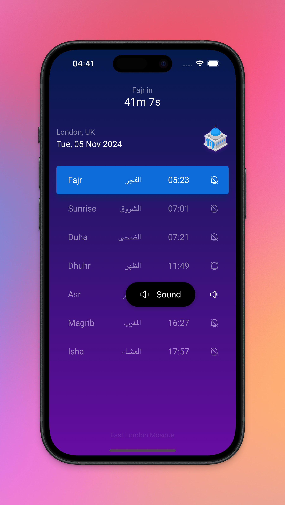
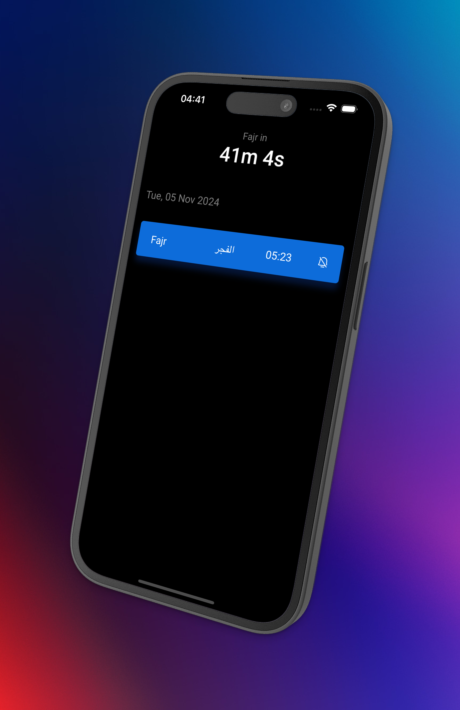
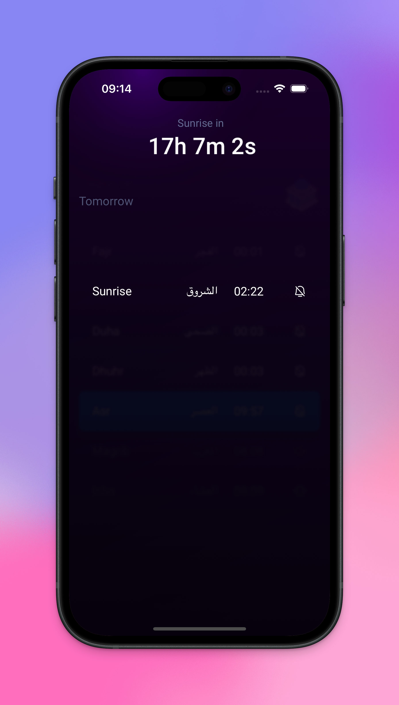

<br/>
<br/>
<br/>

<div align="center">
  
</div>
<br/>

<div align="center">
  
# Athan.uk

<br/>

[](https://athan.uk)
[](https://athan.uk)

A beautiful React Native mobile app for Muslim prayer times in London, UK

[🌐 Web Version Available](https://athan.uk)

</div>

<br/>
<br/>
<br/>

<div align="center">
  
  
  
</div>

<br/>
<br/>
<br/>

## ⚡ Features

- 📅 Displays daily prayer times
- ⏰ Real-time countdown timer until next prayer
- 🔄 View tomorrow's prayer times
- 🔔 Customizable prayer notifications with multiple alert modes:
  - Off (no notifications)
  - Notification (silent banner)
  - Vibrate (vibration + notification banner)
  - Sound (athan + vibration + notification banner)
- 🌙 Smart prayer tracking system
- 💾 Efficient data management with yearly prayer times cached locally
- 🔄 Automatic yearly data refresh
- 🎯 Precise timing synchronization with system clock
- 📱 Full offline support after initial data download

## 🕌 Prayer Times

- **Fajr**
- **Sunrise**
- **Dhuhr**
- **Asr**
- **Magrib**
- **Isha**

- **Last Third (of Night)**: 10 minutes after last third (between Magrib and Fajr)
- **Duha**: 20 minutes after Sunrise
- **Suhoor**: 45 minutes before Fajr
- **Istijaba**: 59 minutes before Magrib, only shown on Fridays

## 🛠 Technical Implementation

### Data Flow

1. First Launch:

   - Fetch entire year's prayer times from API
   - Strip historical dates (before today)
   - Add Duha prayer (20 mins after sunrise)
   - Cache processed data in MMKV storage

2. Daily Operations:

   - Load current day's prayers from cache
   - Track prayer states (passed/next/upcoming)
   - Manage notifications based on user preferences
   - Reset at midnight for new day

3. Year Transition:
   - Detect last prayer (Isha) of year
   - Automatically fetch next year's data

### Timer System

- Main timer: Counts down to next prayer
- Overlay timer: Shows time until selected prayer
- Both timers sync with system clock
- Notification scheduling based on prayer times

### Notification System

Notifications are scheduled:

- For each prayer time
- Maintains consistency even when app is closed
- Automatically schedules next day's Fajr after Isha
- Persists through app restarts

## 🚀 Development

### Prerequisites

- Node.js
- React Native development environment
- Expo CLI

### Installation

1. Start the app (this will clear cache, install dependencies and start the server)

   ```bash
   # Clears cache, installs packages and starts server
   yarn reset
   ```

2. How to install new dependencies

   ```bash
   # Install package
   npx expo install <package-name>
   ```

3. When installing new dependencies that require native modules

   ```bash
   # Install package
   npx expo install <package-name>

   # Development build for iOS
   eas build --profile development --platform ios

   # For physical device:
   # 1. After build success, scan QR code from expo website to install on device
   # 2. Start server
   yarn reset
   # 3. Open installed app that was installed from the QR code

   # For iOS simulator:
   yarn ios # builds native modules for simulator
   yarn reset
   ```

In the output, you'll find options to open the app in a:

- Development build
- Android emulator
- iOS simulator
- Expo Go

### Code Quality

The project uses ESLint and Prettier for code consistency and quality:

- Prettier maintains consistent code formatting
- ESLint enforces code quality rules
- Pre-commit hooks automatically format and lint code
- VS Code `Prettier` and `ESLint` extensions recommended for real-time formatting and linting

## 🎨 Tech Stack


## Athans

- Athan 1: https://www.youtube.com/watch?v=oV-ZRQjgCSk
- Athan 2: https://www.youtube.com/watch?v=9Y-8AtTDx20
- Athan 3: https://www.youtube.com/watch?v=tulY0QvKy_o
- Athan 4: https://www.dailymotion.com/video/x8g7yz2
- Athan 5: https://www.dailymotion.com/video/x8gmb7b
- Athan 6: https://www.youtube.com/watch?v=vS0zBleiJuk
- Athan 7: https://www.youtube.com/watch?v=G96FEkkFCzg
- Athan 8: https://www.youtube.com/watch?v=iaWZ_3D6vOQ
- Athan 9: https://www.youtube.com/watch?v=4_LN0hznp-A
- Athan 10: https://www.youtube.com/watch?v=LHu2NbbZ0i0
- Athan 11: https://www.youtube.com/watch?v=j-G8vgDpxiI
  .

## Icons

- Masjid icon by <a href="https://www.flaticon.com/authors/freepik" title="Freepik">Freepik</a> from <a href="https://www.flaticon.com/" title="Flaticon">www.flaticon.com</a>
