<br/>
<br/>
<br/>

<div align="center">
  
</div>
<br/>

<div align="center">

# Athan.uk

<br/>

[](https://athan.uk)
[](https://athan.uk)
[](https://ios.athan.uk)

A React Native mobile app for Muslim prayer times in London, UK

</div>

<br/>
<br/>
<br/>

## 🎯 Marketing

<br/>

<div align="center">
  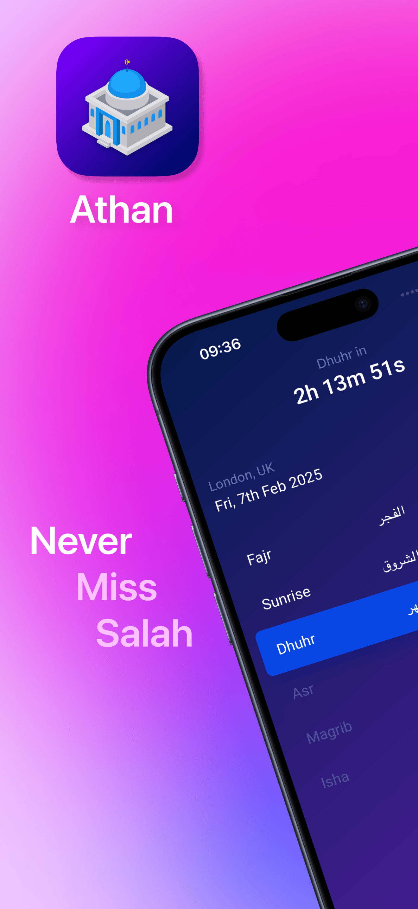
  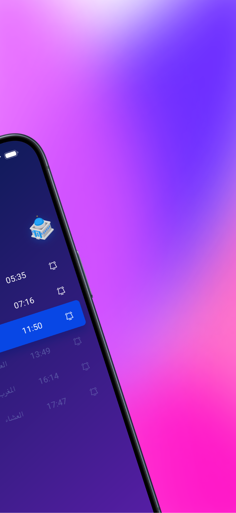
  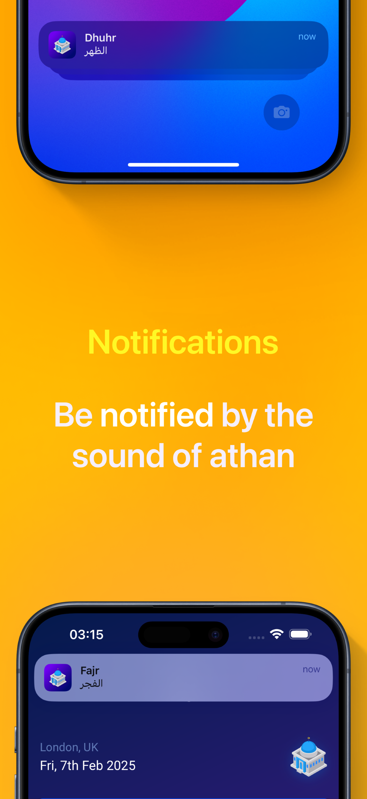
  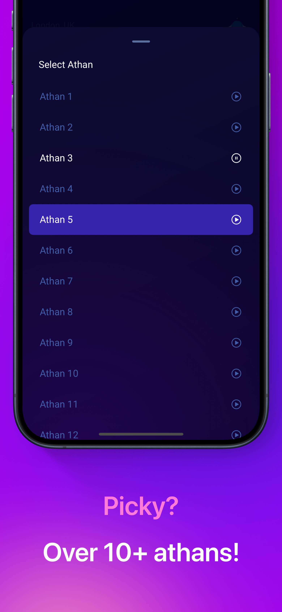
  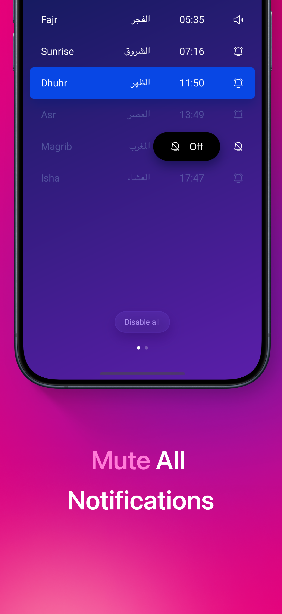
  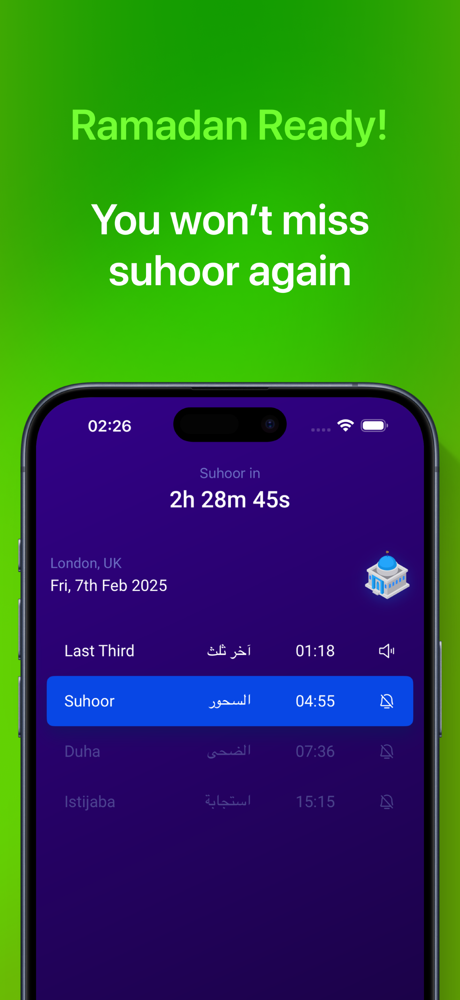
  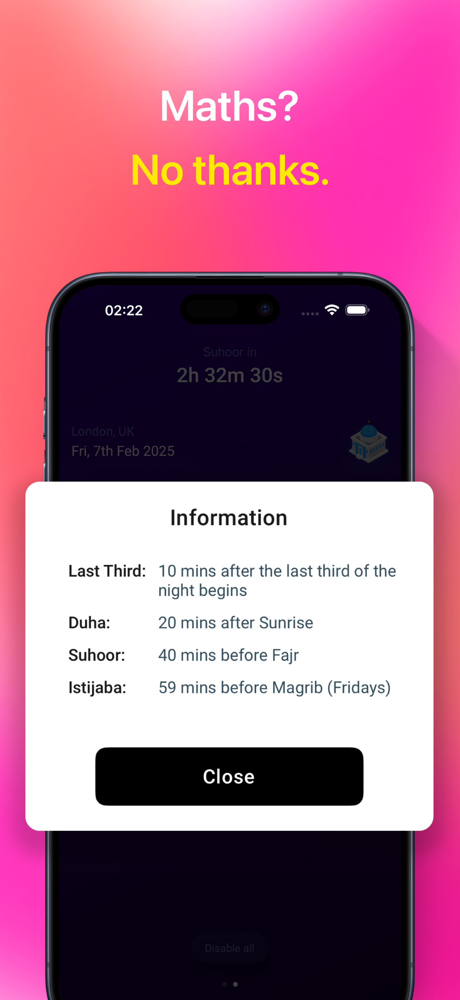
  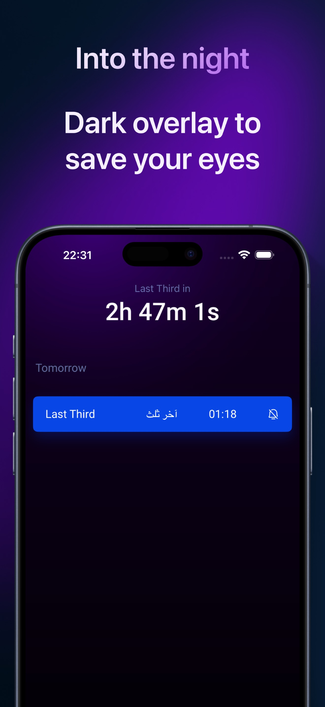
  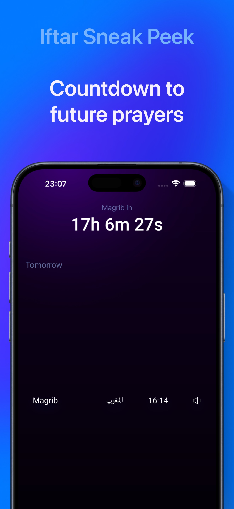
  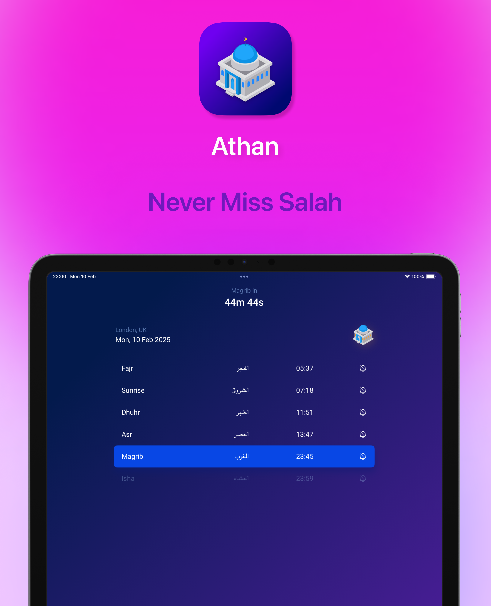
</div>

<br/>
<br/>

### Resources

**[Figma Designs: Marketing](https://www.figma.com/design/FMGlFD7Xz2OUFeGOihFZfO/Untitled?node-id=0-1&t=5PtfJiMrg2OVm1AQ-1)**

**[Figma Designs: App Icon](https://www.figma.com/design/WqP1Vd0aVmyxNuuac4aukJ/Athan-app-icon?node-id=0-1&t=W7KZBNNLhm2vxUgt-1)**

<br/>
<br/>

## 📝 Recent Updates

### v1.17.0 (2026-09-01)

- ✅ **Light & Dark home widgets**: each home-screen widget now comes in a Light and a Dark variant whose look is fixed when you place it — they no longer follow the system appearance. The gallery lists eight kinds (Next Prayer / Extra Times × Light / Dark, each in Small and Medium).

### v1.14.0 (2026-08-31)

- ✅ **Extra Times widgets**: a second Home screen pair ("Extra Times", small + medium) and a second Lock Screen pair (rectangular + inline) mirroring the app's Extras page — Midnight, Last Third, Suhoor, Duha, and Friday-only Istijaba. Styling is identical to the prayer widgets; the medium list reads in the app's canonical order (Istijaba last on Fridays — 4 rows normally, 5 on Fridays) and center-anchors vertically so the top/bottom spacing stays symmetric, with a rose active pill instead of indigo. One shared layout serves both schedules, so the pairs can never drift apart.

### v1.10.0 – v1.12.1 (2026-08-30)

- ✅ **Medium home screen widget**: the 2×4 size pairs the small widget's trio (name · countdown · `HH:mm`) with the day's six prayers exactly like the app's Standard page — the blue active background on the next prayer, passed rows solid, upcoming rows muted, rolling to the next day at Isha (no alert icons, no countdown bar)
- ✅ **Eyebrow pill badge**: the prayer name sits in a soft capsule — periwinkle-white lowercase text over a whisper of sky blue (a hint of the active-prayer blue)
- ✅ **Stale card redesign**: when the timeline runs dry, every surface shows the moon-and-stars mark above "Out of date" with an "Open Athan to refresh" call (two lines on the small card, one on medium)

### v1.9.1 (2026-08-30)

- ✅ **Widget visual polish**: the home screen prayer name is now an uppercase letter-spaced eyebrow in a soft periwinkle that fades into the purple card, the `Sat · London` footer sits closer to the absolute time's tone, and the Lock Screen rectangular widget pairs the countdown with the prayer name (`Magrib · 9m`) with the absolute `HH:mm` below — the duplicate-countdown circular face is retired (orphaned placements render blank)

### v1.9.0 (2026-08-30)

- ✅ **Home screen widget redesign**: "Flat royal" app-theme card (prayer name · minute-ceil countdown · `HH:mm` · `Sat · London` footer), minute-ceil labels everywhere (seconds never display; `59s` → `1m`), a label-flip scheduler that re-pushes within 250ms of every minute change while the app runs, and realistic launch-relative mock data for repeatable testing

Full history: `git log --oneline` (every commit carries its version number).

<br/>
<br/>

## 🗺 Roadmap

### Completed Features

- [x] Prayer times display with real-time countdown
- [x] Prayer-based day boundary with smooth animations (Islamic midnight)
- [x] Offline support with local data caching
- [x] Customizable notifications with multiple alert modes (at-time + reminder)
- [x] Selectable Athan audio notification options (sources credited in the README)
- [x] View tomorrow's prayer times
- [x] Automatic yearly data refresh
- [x] Multipage with special times (Midnight, Third of night, Duha, Suhoor, Istijaba)
- [x] Large overlay font overlay for visually impaired
- [x] Fix UI countdown drift when app in background
- [x] Settings bottom sheet (countdown bar, Hijri date, seconds, time passed, Arabic names, decorations, color picker)
- [x] Alert menu with per-prayer at-time and reminder notification controls
- [x] Background notification refresh task (~6 hour intervals, verified on device to keep the buffer rolling unattended — incl. reboots and closed-app states)
- [x] SDK 57 upgrade (React 19, RN 0.86, Expo 57)
- [x] Update popup with version checking and store redirect
- [x] Ramadan seasonal decorations (lantern, moon, stars, spark particles, clouds)
- [x] Notification system documentation and scenario coverage (14 scenarios)
- [x] iOS home screen + Lock Screen widgets, prayer + extras pairs (v1.7–v1.14)

### Known Limitations

- Some Android devices may receive notifications 1–3 minutes off (hardware/driver issue, unfixable in app — see ai/ISSUES.md #10/#11)

### Upcoming Improvements

- [ ] Multi-location support — deferred indefinitely; the research concluded scraping is unnecessary ([ADR-008](ai/adr/008/ADR.md) / [ADR-009](ai/adr/009/ADR.md))
- [ ] Qibla direction finder

<br/>
<br/>

## 📱 iOS Widgets

Athan ships iOS home screen and Lock Screen widgets built with [`expo-widgets`](https://docs.expo.dev/versions/latest/sdk/widgets/) and [`@expo/ui`](https://docs.expo.dev/versions/latest/sdk/ui/swift-ui/) — no native SwiftUI code required.

| Widget | Families | Shows |
| --- | --- | --- |
| **Next Prayer** (home screen) | Small, Medium | Offered in **Light** and **Dark**. **Small** — the next prayer only, on the translucent card: uppercase bold rose prayer name, minute-ceil countdown (`2h`, `1h 12m`, `9m`, `1m`), the prayer's `HH:mm`, and a `Sat · Lon` footer. **Medium** — the same trio on the left; on the right, the day's six prayers exactly like the app's Standard page: the indigo active pill on the next prayer, passed rows solid, upcoming rows muted (no alert icons, no countdown bar) |
| **Extra Times** (home screen) | Small, Medium | Offered in **Light** and **Dark**. The same two sizes for the Extras schedule. **Small** — identical to the prayer widget (next extra time only). **Medium** — the app's Extras page list in canonical order: Midnight, Last Third, Suhoor, Duha, Istijaba (Fridays only — 4 rows normally, 5 on Fridays), center-anchored vertically so the spacing stays symmetric as the list grows, with a **rose** active pill instead of indigo |
| **Next Prayer** (Lock Screen) | Rectangular, Inline | The next prayer paired with the minute-ceil countdown (`Magrib · 9m`) and the absolute `HH:mm` below, rendered in the system's vibrant (monochrome) style |
| **Extra Times** (Lock Screen) | Rectangular, Inline | The same faces for the Extras schedule — the next extra time with its countdown and absolute `HH:mm`, in the same vibrant style |

Each home-screen widget's Light or Dark look is fixed when you place it — it never follows the system appearance.

**Always in sync, never stale:**

- The app pushes a **14-day timeline per schedule × theme** (one entry per boundary, eight home widgets in four schedule×theme pairs plus the two Lock Screen pairs) at every point fresh data is known: app sync, foreground return, the 12-hour notification refresh, the 6-hour background task, and — debounced — any change to a widget-visible setting.
- The countdown label is a **minute-ceil value** — seconds never display at any distance and the label always rounds up (`1h 59m 01s` → `2h`, `59s` → `1m`), holding its value until the true minute flips. It is precomputed per timeline entry and refreshed by stepped entries every 5 minutes (WidgetKit's minimum entry spacing) for the first 24 hours; beyond that it updates at each boundary. The final step before a boundary always anchors exactly one spacing ahead of the flip.
- While the app is running, a **label-flip scheduler** re-pushes both timelines within a quarter second of every countdown minute change (armed at whichever schedule's label flips next), so no widget shows a stale minute for long. Backgrounded timers coalesce into one refresh on the app's return to the foreground.
- Entries transition automatically at each time's boundary; the list rolls to the next day exactly when the countdown target does (at Isha for the prayer widgets, at the night's Midnight for the extras widgets) — DST-safe via the same zoned-time logic as the app. Adjacent entries always keep WidgetKit's minimum 5-minute spacing, including the very first entry at push time (whose label describes the push instant, never a backdated one).
- If the app stays unopened past the full timeline, the widgets switch to the **stale card** — the moon-and-stars mark above "Out of date" with an "Open Athan to refresh" call (two lines on the small card, one line on medium) — instead of silently showing stale times. Opening the app (even for a second) pushes a fresh 14-day timeline immediately.

**Widget preferences — the widget has no configuration of its own; it mirrors the app:**

- Hijri dates (`preference_hijri_date` — the footer shows the Hijri month when enabled)

Changing it in the app re-pushes the widget timeline within about a second.

**Adding a widget:** long-press the home screen → **Edit → Add Widget** → *Athan* → choose **Next Prayer** or **Extra Times** in your preferred **Light** or **Dark**. Lock Screen widgets: long-press the Lock Screen → **Customise → Add Widgets** → *Athan* (rectangular + inline faces per schedule; the circular face was retired in v1.9.1 and fully removed from the picker in v1.14.1).

> Widgets require a development build or production binary (iOS 16.4+); they are not available in Expo Go.

<br/>
<br/>

## 📡 Data Source

Prayer times data sourced from [London Prayer Times](https://www.londonprayertimes.com/)

<br/>

## 🎵 Athan Audio Sources

Every selectable Athan sound comes from a public recording

1. [Athan 1](https://www.youtube.com/watch?v=_FLhwe8lk14)
2. [Athan 2](https://youtu.be/GwRoKbB-aWo)
3. [Athan 3](https://youtu.be/pY_7ahJV8Qo)
4. [Athan 4](https://www.youtube.com/watch?v=EwCb9d-aYsw)
5. [Athan 5](https://www.youtube.com/watch?v=MaEzj5eRmjc)
6. [Athan 6](https://www.youtube.com/watch?v=iaWZ_3D6vOQ)
7. [Athan 7](https://www.youtube.com/watch?v=qijUyKRiaHw)
8. [Athan 8](https://www.tiktok.com/@sy._454/video/7478742017174965526)
9. [Athan 9](https://vm.tiktok.com/ZN8eTKymA)
10. [Athan 10](https://vm.tiktok.com/ZN8ewBrH3)
11. [Athan 11](https://vm.tiktok.com/ZN8dJroHG)
12. [Athan 12](https://vm.tiktok.com/ZN8RxBFGL)
13. [Athan 13](https://www.youtube.com/watch?v=vS0zBleiJuk)
14. [Athan 14](https://www.youtube.com/watch?v=LxchYJnAY6c)
15. [Athan 15](https://www.youtube.com/watch?v=LSPXGersP-k)
16. [Athan 16](https://www.youtube.com/watch?v=uSU_perLUC4)
17. [Athan 17](https://www.youtube.com/watch?v=IqwB9fS8vdo&list=PLN-zlYr1ZP07sMCdy-qToyZ2HQTwDU0iz&index=6)
18. [Athan 18](https://www.youtube.com/watch?v=G96FEkkFCzg)
19. [Athan 19](https://www.youtube.com/watch?v=aB-1qzmtxaA)
20. [Athan 20](https://vm.tiktok.com/ZN8ewMvhL)
21. [Athan 21](https://vm.tiktok.com/ZN8ewVELB)
22. [Athan 22](https://www.youtube.com/watch?v=4_LN0hznp-A)
23. [Athan 23](https://www.youtube.com/watch?v=9Y-8AtTDx20)
24. [Athan 24](https://www.youtube.com/watch?v=eLGZQpfGEh8)
25. [Athan 25](https://youtu.be/4POoJPsLuz0)
26. [Athan 26](https://www.youtube.com/watch?v=CcAqiX3SNIo)
27. [Athan 27](https://www.dailymotion.com/video/x8gmb7b)
28. [Athan 28](https://www.youtube.com/watch?v=WVLSfmZcsp0)
29. [Athan 29](https://www.youtube.com/watch?v=keTILkYmLJM)
30. [Athan 30](https://www.youtube.com/watch?v=a1U-G2DnC_4)
31. [Athan 31](https://www.youtube.com/watch?v=eRqwFHzJrGc&list=PLN-zlYr1ZP07sMCdy-qToyZ2HQTwDU0iz&index=13)
32. [Athan 32](https://www.youtube.com/watch?v=j-G8vgDpxiI)

<br/>

## 🎙️ Reminder Audio Sources

Every reminder sound is custom recorded audio for reminders — recorded and edited by the maintainer in [Audacity](https://www.audacityteam.org/), not published elsewhere.

<br/>

## 🎛️ Source Projects

The full Audacity projects for all Athan and reminder audio (for anyone who wants to edit, remix, or re-export the sounds) are available on the [releases page](https://github.com/capt-muji/rn.athan.uk/releases).

<br/>

## ⚡ Features

### Display & User Interface

- 📅 **Daily Prayer Times**: View all 6 standard prayers plus 5 special prayers
- ⏰ **Real-time Countdown**: Live countdown showing exact time remaining
- 🔄 **Tomorrow's Prayer Times**: Swipe between today and tomorrow
- 🔍 **Large Overlay Font**: Accessible mode for visually impaired
- 🌙 **Smart Prayer Tracking**: Automatically tracks passed/next/upcoming prayers
- ⚙️ **Settings**: Countdown bar toggle + color picker, Hijri date, show seconds, time passed, Arabic names, seasonal decorations
- 🗓️ **Hijri Date**: Optional Islamic calendar format
- 🕌 **Arabic Prayer Names**: Optional dual-language display

### Notifications & Alerts

- 🔔 **Customizable Alerts**: Off / Silent / Sound per prayer (at-time and reminder)
- ⏰ **Configurable Reminders**: 5-30 minute pre-prayer reminders with adjustable interval — every prayer × interval plays its own custom audio (see [Reminder Audio Sources](#-reminder-audio-sources))
- 📢 **Selectable Athan Sounds**: Every sound linked to its source (see [Athan Audio Sources](#-athan-audio-sources))
- 📅 **Smart Notification Buffer**: 2-day rolling schedule that keeps renewing itself in the background (~every 6 hours) even if the app is never opened
- 🛡️ **Sequential Scheduling Queue**: Operations queued and executed in order, never dropped
- 🪪 **Deterministic Notification IDs**: `athan_<schedule>_<prayer>_<date>` (reminders include the interval) — re-scheduling with the same ID replaces in place on both platforms, so orphaned alarms can never double-fire

### Data & Offline Support

- 💾 **Local Data Caching**: Entire year stored in MMKV v4
- 🔄 **Automatic Yearly Refresh**: Detects year transition, fetches new data
- 📱 **Full Offline Support**: Works after initial sync
- 🎯 **Precise Synchronization**: Countdown countdowns sync with system clock
- ⬆️ **Smart App Upgrades**: Clears stale cache, preserves preferences

<br/>

## 🔄 Update Popup

The app checks for new versions once every 24 hours on launch (`device/updates.ts`). The installed version is compared against the store/remote version using semantic versioning (`shared/versionUtils.ts`):

| Scenario                                          | Result                                                                                                                                                                                                   |
| ------------------------------------------------- | -------------------------------------------------------------------------------------------------------------------------------------------------------------------------------------------------------- |
| **Remote version greater than installed version** | User sees a dismissible update popup with "Later" and "Update" buttons. "Update" opens the platform's app store. "Later" dismisses the popup. The popup will reappear on the next launch after 24 hours. |
| **Remote version equal to installed version**     | Nothing happens. No popup shown. The user is on the latest version.                                                                                                                                      |
| **Remote version less than installed version**    | Nothing happens. No popup shown. The user has a newer version than what is listed remotely (e.g., the remote config hasn't been updated yet after a release).                                            |
| **Remote version is `null` or fetch fails**       | Nothing happens. No popup shown. The check is silently skipped and retried after 24 hours. The app never crashes from a failed update check.                                                             |

The popup modal is implemented in `components/modals/Update.tsx` and its state is managed by `popupUpdateEnabledAtom` in `stores/ui.ts`.

### Version Sources

Environment is determined by `EXPO_PUBLIC_ENV` via `isProd()` in `shared/config.ts`. When set to `prod`, the production path is used; all other values (`preview`, `local`, unset) use the UAT path.

| Environment    | iOS                                                                   | Android                                                    |
| -------------- | --------------------------------------------------------------------- | ---------------------------------------------------------- |
| **Production** | iTunes Lookup API (`itunes.apple.com/lookup?bundleId=...&country=gb`) | `releases.json` → `production.updatePopup.android.version` |
| **UAT**        | `releases.json` → `uat.updatePopup.ios.version`                       | `releases.json` → `uat.updatePopup.android.version`        |

Production iOS uses the iTunes API for automatic detection. All other combinations read from `releases.json` at the repository root on the `main` branch (fetched via `raw.githubusercontent.com`). Changes to `releases.json` on other branches have no effect.

> **Note:** `production.updatePopup.ios.version` is set to `null` by design — production iOS version detection is fully automatic via the iTunes API, so this field is never read. Setting it to any value has no effect. It exists for structural consistency.

Each entry in `releases.json` has a `_comment` field explaining its purpose, the version comparison behavior, and when to update it.

### Release Workflow

1. Fill in the What's New content for this release in `shared/whatsNew.ts` (see below)
2. Push new app update to stores
3. Wait for store release
4. Update the appropriate version in `releases.json` on `main` branch
5. Users on outdated versions see the update popup on next launch (within 24 hours)

### Throttle & Failure Behavior

The 24-hour throttle timer is always set regardless of whether the check succeeds or fails. This means:

- On success: the next check occurs no sooner than 24 hours later
- On failure (network error, malformed response, etc.): the check is silently skipped and the next retry occurs no sooner than 24 hours later
- The app never shows an error to the user for a failed update check

<br/>

## 🆕 What's New Popup

After a user updates the app, a one-time "What's New" modal tells them what they got (`shared/whatsNew.ts` + `components/modals/WhatsNew.tsx`). It exists because ~half the base auto-updates (never seeing store release notes) — this is the only channel that reliably reaches them.

| Scenario                                        | Result                                                                                              |
| ----------------------------------------------- | --------------------------------------------------------------------------------------------------- |
| **Update to a release with What's New content** | Modal shows once, on the first launch after the update (works identically for auto and manual updates) |
| **Update skipping several versions**            | Same modal — only the installed version's items, never accumulated history                          |
| **Update to a silent release (content is null)**| No modal — bug-fix-only releases stay quiet                                                         |
| **Fresh install**                               | Never shows — the shown-version tracker is seeded at first boot                                     |
| **Uninstall + reinstall**                        | Never shows — storage is wiped, reinstall counts as a fresh install                                 |
| **Relaunch on the same version**                 | Never shows again — shown once per version, marked on display (crash-safe)                          |

Behavior notes:

- The version in the title is read from the installed binary at runtime (never a hand-typed string; EAS manages store versions remotely)
- Every item declares its platform availability with glyphs in the leading column: Apple for iOS-exclusive, Android for Android-exclusive, both stacked for cross-platform — identical on every device, never a filter
- If the update nag is also eligible (user landed on a non-latest version), What's New shows first; the nag appears after Continue — modals never stack
- Settings → About → "What's new" re-opens the modal anytime (hidden automatically on silent releases)

### Release Ritual (What's New)

Every store release, edit `WHATS_NEW` in `shared/whatsNew.ts`:

1. Set `version` to the store version being submitted
2. List 1–4 **user-facing items only** — new abilities, removed functionality, behavior changes users will notice. No technical work (SDK migrations, performance, refactors belong in store release notes/README). Factual copy, no marketing
3. Set `WHATS_NEW` to `null` to silent-ship a release (fixes/polish only)

A content contract test (`shared/__tests__/whatsNew.test.ts`) guards the shape: item count, title/body length caps, valid icons and platforms. Dev preview: `EXPO_PUBLIC_WHATS_NEW_PREVIEW=1` in `.env` forces the modal on cold launch (dev builds only). Design rationale: [ADR-012](ai/adr/012/ADR.md).

<br/>

## 🕌 Prayer Times

### Standard Prayers (6)

| Prayer      |
| ----------- |
| **Fajr**    |
| **Sunrise** |
| **Dhuhr**   |
| **Asr**     |
| **Magrib**  |
| **Isha**    |

### Extra Prayers (5)

| Prayer                  | Time                                    |
| ----------------------- | --------------------------------------- |
| **Midnight**            | Midpoint between Magrib and Fajr        |
| **Last Third of Night** | Start of last third of night            |
| **Suhoor**              | 20 minutes before Fajr                  |
| **Duha**                | 20 minutes after Sunrise                |
| **Istijaba**            | 60 minutes before Magrib (Fridays only) |

<br/>

## 🛠 Technical Overview

### Architecture

- **Framework**: React Native 0.86.3, Expo 57.0.22
- **Language**: TypeScript 7.0 (strict)
- **State**: Jotai atoms (no Redux/Context)
- **Storage**: MMKV v4 (Nitro Module)
- **Animation**: Reanimated 4 (worklets)
- **Notifications**: Expo Notifications
- **Dates**: date-fns / date-fns-tz (London timezone)

### Key Design Decisions

1. **Prayer-Centric Timing**: Full DateTime objects, not date+time strings (avoids midnight-crossing bugs)
2. **Prayer-Based Day Boundary**: Schedule advances after final prayer, not midnight
3. **Independent Schedules**: Standard and Extras can show different dates
4. **NO FALLBACKS**: Data layer always provides complete data, UI layer trusts the data

### Data Flow

```
API → Process (strip old dates, calculate special prayers) → Cache MMKV → Display → Schedule notifications
```

### Storage (MMKV)

```
MMKV
├── Prayer Data: prayer_YYYY-MM-DD
├── Fetched Years: fetched_years
├── Notifications: scheduled_notifications_*, scheduled_reminders_*
└── Preferences: preference_* (alert/reminder settings keyed by prayer name,
    e.g. preference_alert_standard_fajr, preference_reminder_interval_extra_istijaba)
```

### Codebase Organization

The codebase follows a clean architecture pattern with clear separation of concerns:

```
├── app/                    # App entry points and navigation
│   ├── index.tsx          # Root component, initialization
│   ├── _layout.tsx        # App layout wrapper
│   ├── Navigation.tsx     # Pager navigation (Standard/Extra pages)
│   └── Screen.tsx         # Screen wrapper
│
├── components/            # UI components (organized by feature)
│   ├── prayer/            # Prayer display (Prayer, Alert, Time, Ago, etc.)
│   ├── countdown/         # Countdown timer (Countdown, Bar)
│   ├── overlay/           # Full-screen overlay
│   ├── sheets/            # Bottom sheets (screens/, parts/)
│   ├── modals/            # Modal dialogs (Modal, Update)
│   ├── ui/                # Shared UI (Icon, Masjid, Glow, Error, etc.)
│   └── day/               # Day component
│
├── hooks/                 # Custom React hooks (logic extraction)
│   ├── useAlertAnimations.ts  # Alert icon animations
│   ├── useAnimation.ts        # Animation utilities
│   ├── useCountdown.ts        # Countdown state hook
│   ├── useCountdownBar.ts     # Progress bar hook
│   ├── useNotification.ts     # Notification handling
│   ├── usePrayer.ts           # Prayer state and actions
│   ├── usePrayerAgo.ts        # Time-ago display
│   ├── usePrayerSequence.ts   # Prayer sequence logic
│   ├── useSchedule.ts         # Schedule management
│   └── useWindowDimensions.ts # Screen dimension hook
│
├── stores/                # State management (Jotai atoms)
│   ├── atoms/
│   │   └── overlay.ts     # Overlay atom (state)
│   ├── schedule.ts        # Prayer sequence state
│   ├── notifications.ts   # Notification state
│   ├── countdown.ts       # Countdown state
│   ├── widget.ts          # Widget IO layer (pushes timelines, iOS)
│   ├── overlay.ts         # Overlay actions
│   ├── sync.ts            # Data sync and initialization
│   ├── database.ts        # MMKV storage wrapper
│   ├── storage.ts         # MMKV instance setup
│   ├── ui.ts              # UI state atoms
│   └── version.ts         # App version management
│
├── widgets/               # iOS widget LAYOUTS ('widget'-directive functions)
│   ├── PrayerWidget.tsx   # Home screen widget (systemSmall)
│   └── LockPrayerWidget.tsx # Lock Screen widget (Rectangular/Inline)
│
├── shared/                # Shared utilities and constants
│   ├── config.ts          # App configuration
│   ├── constants.ts       # App constants (colors, timings, etc.)
│   ├── logger.ts          # Logging wrapper (Pino)
│   ├── notifications.ts   # Notification utilities
│   ├── prayer.ts          # Prayer creation and calculations
│   ├── text.ts            # Text formatting utilities
│   ├── time.ts            # Time manipulation utilities
│   ├── types.ts           # TypeScript type definitions
│   ├── versionUtils.ts    # Version comparison utilities
│   ├── widgetTimeline.ts  # Pure widget timeline builder
│   ├── widgetTypes.ts     # Widget props contract + settings types
│   ├── __tests__/         # Unit tests (incl. widget contract & simulation)
│   └── __mocks__/         # Module mocks for testing
│
├── api/                   # API client
│   ├── client.ts          # Prayer times API fetch/transform
│   └── config.ts          # API configuration
│
├── device/                # Device-specific code
│   ├── notifications.ts   # Platform notification handlers
│   ├── listeners.ts       # App state listeners
│   ├── updates.ts         # App update handling
│   └── tasks.ts           # Background task management
│
├── mocks/                 # Mock data for development and testing
│   ├── simple.ts          # Launch-relative mock data (used in dev mode)
│   ├── full.ts            # Full-year reference dataset (structure reference, unused)
│   └── timing-system-schema.ts  # Timing system type reference and examples (unused)
│
└── ai/                    # AI agent instructions and ADRs
    ├── AGENTS.md          # Agent behavior instructions
    ├── ISSUES.md          # Issue ledger (decisions, anti-re-litigation)
    ├── USAGE.md           # Sim/mock-cascade runbook
    ├── prompts/           # AI prompt templates
    ├── adr/               # Architecture Decision Records
    └── features/          # Feature specification templates
```

### Key Patterns

1. **Data Flow**: Components → Hooks → Stores → Shared/Api → MMKV
2. **State Management**: Jotai atoms with derived atoms for computed values
3. **Animations**: Reanimated worklets with custom hooks
4. **Date Handling**: All dates in London timezone using date-fns-tz

### Code Quality

- **Testing**: Jest with babel-jest + @babel/preset-typescript for unit tests (`yarn test`); typechecking is a separate `tsc --noEmit` step
- **Type Safety**: Full TypeScript coverage with strict mode
- **Linting**: Biome (lint + format, 120 char lines, 2 spaces, single quotes)
- **Logging**: Pino logger (no console.log statements)
- **JSDoc**: All public functions documented with examples

### Architecture Patterns

The codebase follows established patterns for consistency:

1. **Helper Function Extraction**: Complex logic extracted into named functions
   - Example: `parseNightBoundaries()` in time.ts
   - Example: `getYesterdayFinalPrayer()` in schedule.ts

2. **Section Comments**: Files organized with clear section headers

   ```typescript
   // =============================================================================
   // SECTION NAME
   // =============================================================================
   ```

3. **Animation Hook Extraction**: Component animations encapsulated in hooks
   - Example: `useAlertAnimations.ts` for Alert component

4. **Sequential Queue Pattern**: Queue-based scheduling lock for notification operations
   - Example: `withSchedulingLock()` in notifications.ts

See `ai/adr/` for Architecture Decision Records.

## 🎨 Tech Stack


<br/>

## 🚀 Development

### Prerequisites

- Node.js 24+
- Expo CLI (v57+)
- iOS: Xcode 15+ (for iOS simulator/device builds)
- Android: Android Studio with NDK (for native module builds)

### Installation

1. Start the app (this will clear cache, install dependencies and start the server)

   ```bash
   # Clears cache, installs packages and starts server
   yarn reset
   ```

2. How to install new dependencies

   ```bash
   # Install package
   npx expo install <package-name>
   ```

3. When installing new dependencies that require native modules

   ```bash
   # Install package
   npx expo install <package-name>

   # Development build for iOS
   eas build --profile development --platform ios

   # For physical device:
   # 1. After build success, scan QR code from expo website to install on device
   # 2. Start server
   yarn reset
   # 3. Open installed app that was installed from the QR code

   # For iOS simulator:
   yarn ios # builds native modules for simulator
   yarn reset
   ```

In the output, you'll find options to open the app in a:

- Development build
- Android emulator
- iOS simulator

<br/>

## Athans

- Athan 1: https://www.youtube.com/watch?v=oV-ZRQjgCSk
- Athan 2: Unspecified
- Athan 3: https://www.youtube.com/watch?v=tulY0QvKy_o
- Athan 4: https://www.dailymotion.com/video/x8g7yz2
- Athan 5: https://www.dailymotion.com/video/x8gmb7b
- Athan 6: https://www.youtube.com/watch?v=vS0zBleiJuk
- Athan 7: https://www.youtube.com/watch?v=G96FEkkFCzg
- Athan 8: https://www.youtube.com/watch?v=iaWZ_3D6vOQ
- Athan 9: https://www.youtube.com/watch?v=4_LN0hznp-A
- Athan 10: https://www.youtube.com/watch?v=LHu2NbbZ0i0
- Athan 11: https://www.youtube.com/watch?v=j-G8vgDpxiI
- Athan 12: https://www.youtube.com/watch?v=9Y-8AtTDx20
- Athan 13: https://www.youtube.com/watch?v=qijUyKRiaHw
- Athan 14: Unspecified
- Athan 15: https://www.youtube.com/watch?v=CxI53S_otJA
- Athan 16: Unspecified

<br/>

### Screenshots

<div align="center">
  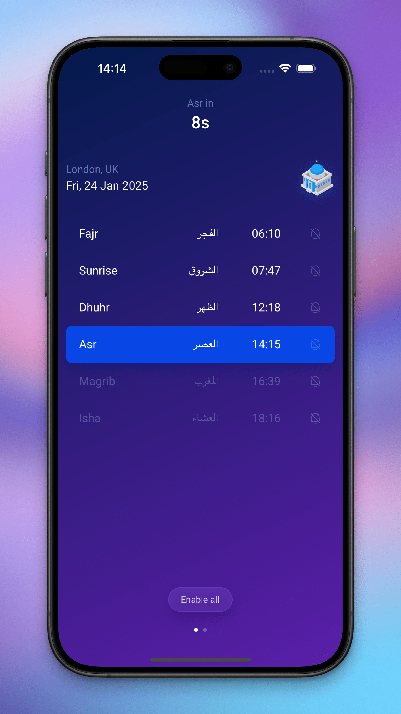
  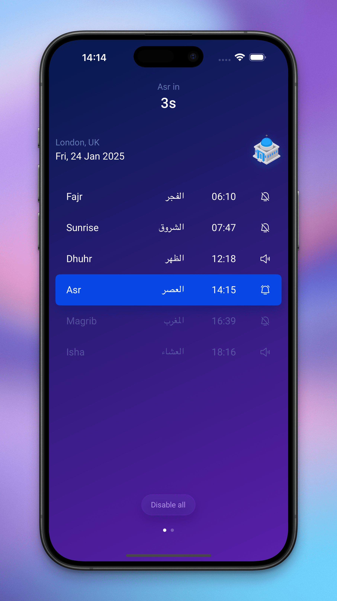
  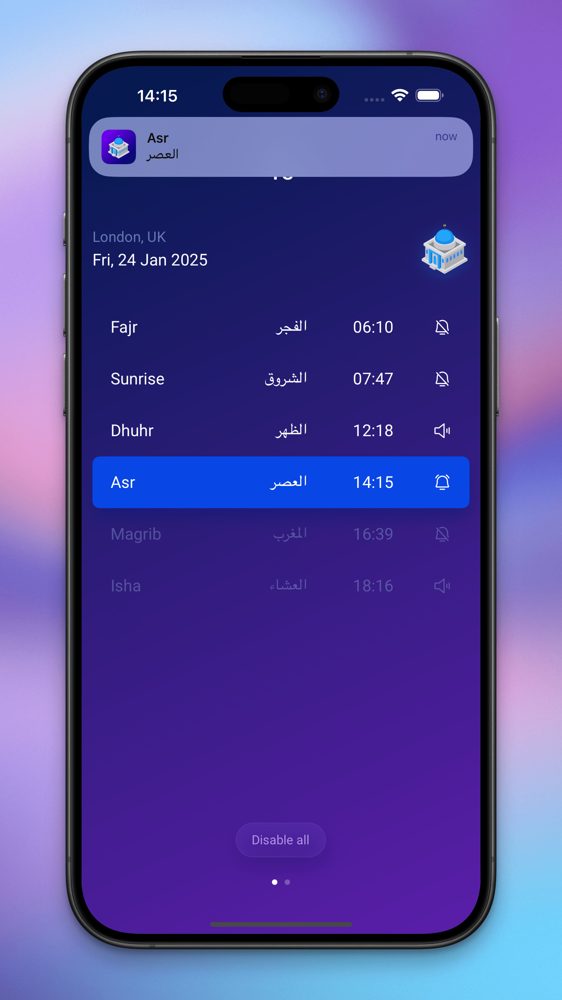
  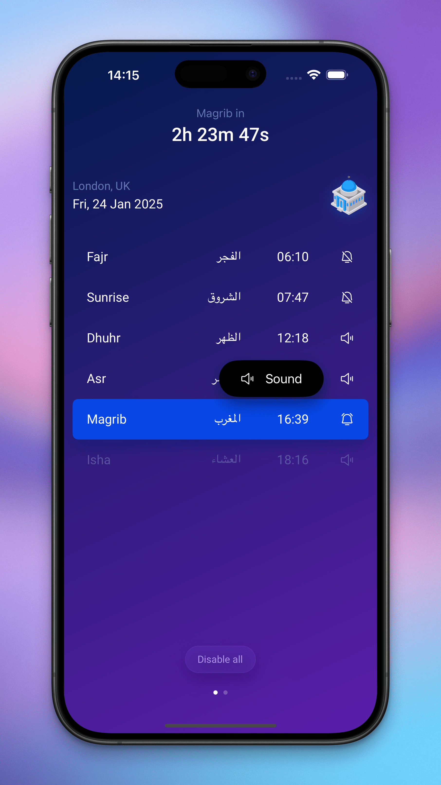
  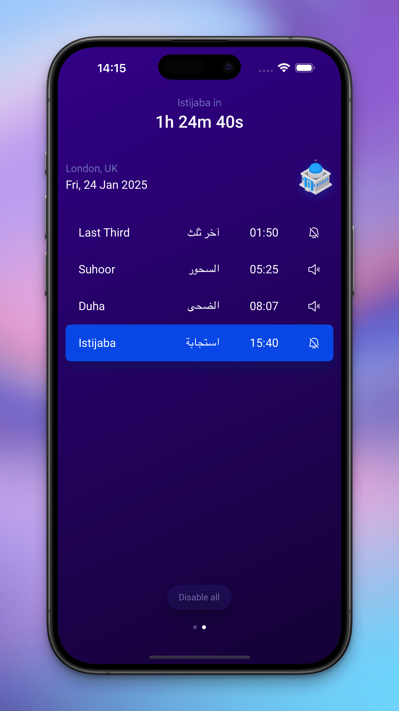
  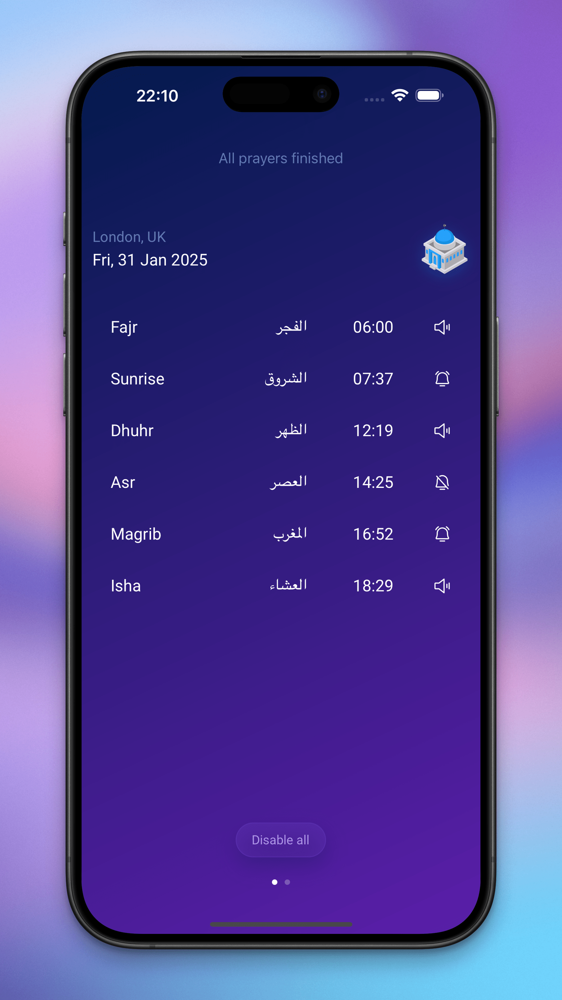
  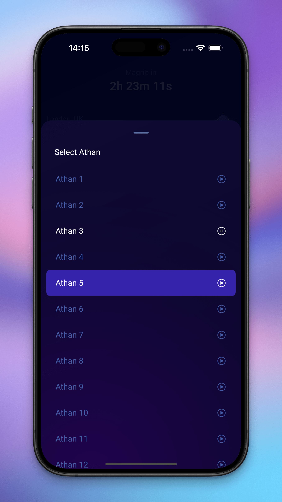
  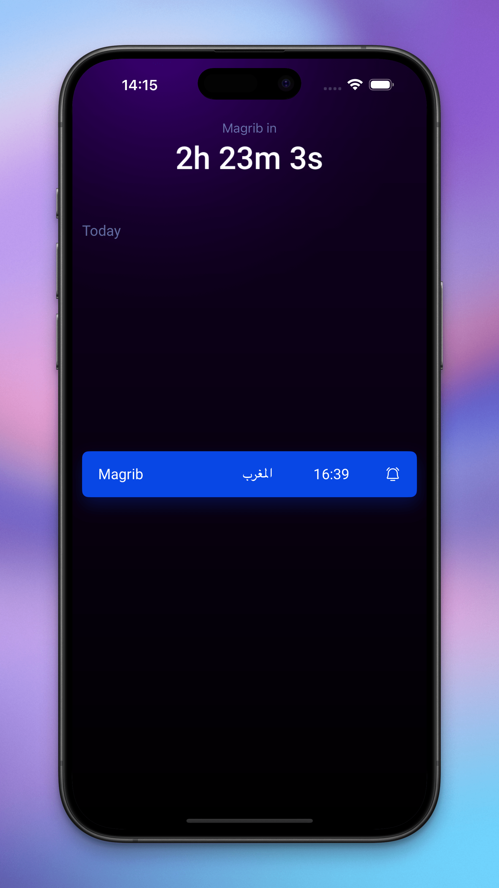
  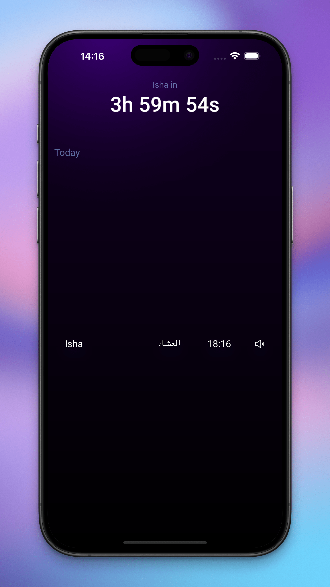
  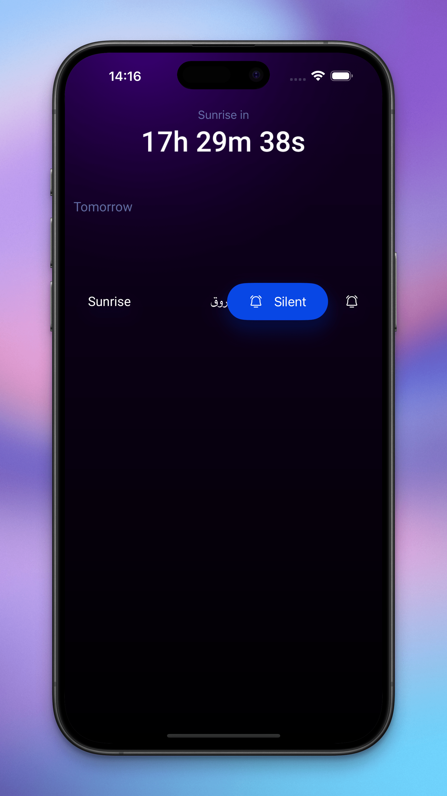
  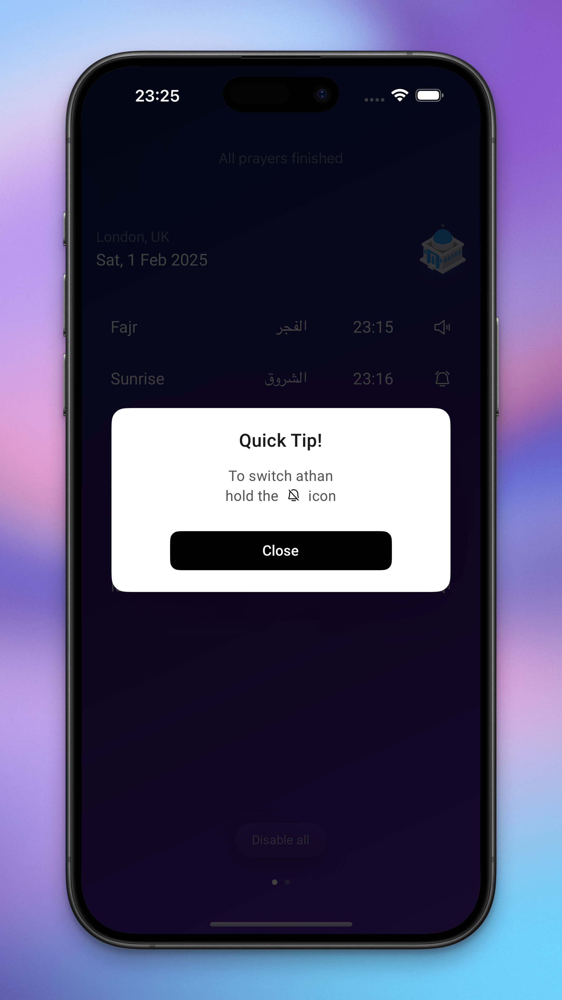
  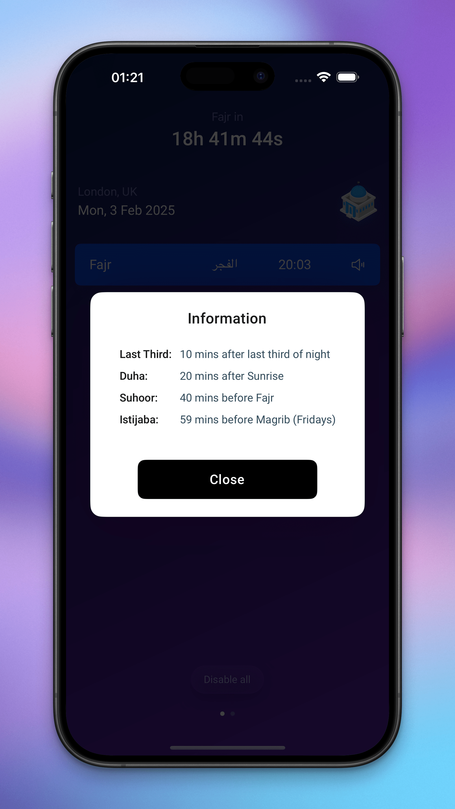
  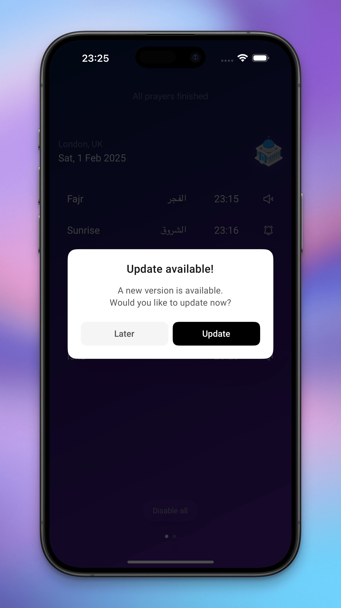
</div>

<br/>

### Notification System

A **2-day rolling buffer** of scheduled notifications per enabled prayer (6 Standard + 5 Extra), refreshed every 12 hours in the foreground and ~6-hour background-task cycles:

- Deterministic identifiers (`athan_<schedule>_<prayer>_<date>`) make duplicate alarms structurally impossible — rescheduling an existing ID replaces it natively
- All entry points serialize through `withSchedulingLock()` (queue-based, no operation ever dropped)
- Per-prayer at-time + reminder preferences (sound, interval) stored under name-based MMKV keys, auto-migrated from legacy keys
- Cache wipes (app upgrade, error boundary, lock contention) trigger a full reschedule on next launch/resume

Architecture and the full 14-scenario reschedule matrix: [ADR-001](ai/adr/001-rolling-notification-buffer.md), [ADR-007](ai/adr/007-background-task-notification-refresh.md), and the issue ledger ([ai/ISSUES.md](ai/ISSUES.md)).
