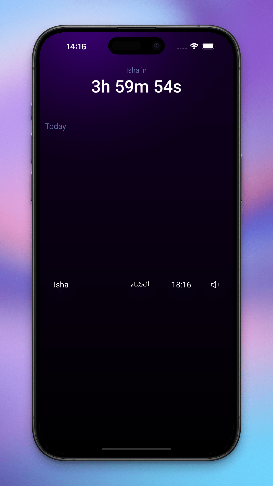

<br/>
<br/>
<br/>

<div align="center">
  
</div>
<br/>

<div align="center">
  
# Athan.uk

<br/>

[](https://athan.uk)
[](https://athan.uk)
[](https://ios.athan.uk)

A React Native mobile app for Muslim prayer times in London, UK

</div>

<br/>
<br/>
<br/>

## 🎯 Marketing

<br/>

<div align="center">
  
  
  
  
  
  
  
  
  
  
</div>

<br/>
<br/>

### Resources

**[Figma Designs: Marketing](https://www.figma.com/design/FMGlFD7Xz2OUFeGOihFZfO/Untitled?node-id=0-1&t=5PtfJiMrg2OVm1AQ-1)**

**[Figma Designs: App Icon](https://www.figma.com/design/WqP1Vd0aVmyxNuuac4aukJ/Athan-app-icon?node-id=0-1&t=W7KZBNNLhm2vxUgt-1)**

<br/>
<br/>

## 🗺 Roadmap

### Completed Features

- [x] Prayer times display with real-time countdown
- [x] Midnight reset with animations
- [x] Offline support with local data caching
- [x] Customizable notifications with multiple alert modes
- [x] Over 10 selectable Athan audio notification options
- [x] View tomorrow's prayer times
- [x] Automatic yearly data refresh
- [x] Multipage with special times (Third of night, Duha, Suhoor, Istijaba)
- [x] Large overlay font overlay for visually impaired
- [x] Fix UI timer drift when app in background
- [x] Add a "Tips" popup on first ever open
- [x] Change app name on homescreen to 'Athan'
- [x] Refactor English width calculation to run once
- [x] Only check for update every 24hrs
- [x] Do not cache app version URL check
- [x] Only show "Information" popup on 2nd page
- [x] Create Android notification outline icon
- [x] Swap from Skia background to expo-linear-gradient (better android performance)
- [x] Optimise app to be iPad friendly
- [x] Replace Skia with expo-linear-gradient
- [x] Upgrade to Expo SDK v52+ (new architecture)
- [x] Upgrade to Reanimated v4 (needs new architecture)
- [x] Timer on popup
- [x] Enable IOS 'active' alert for notifications

### Upcoming Improvements

- [ ] Remove redundant background task logic
- [ ] Handle different versions of android for critical notifications (Alarms & Reminders)
- [ ] Fix Android bugs
- [ ] Add widget support
- [ ] Add Qibla direction finder
- [ ] Support for locations outside London (will be an open source standalone project)

## 📡 Data source

Prayer times data sourced from [London Prayer Times](https://www.londonprayertimes.com/)

## ⚡ Features

- 📅 Displays daily prayer times
- ⏰ Real-time countdown timer until next prayer
- 🔄 View tomorrow's prayer times
- 🔔 Customizable prayer notifications with multiple alert modes:
  - Off (no notifications)
  - Silent (banner only)
  - Sound (athan + vibration + notification banner)
- 🌙 Smart prayer tracking system
- 💾 Efficient data management with yearly prayer times cached locally
- 🔄 Automatic yearly data refresh
- 🎯 Precise timing synchronization with system clock
- 📱 Full offline support

## 🕌 Prayer Times

- **Fajr**
- **Sunrise**
- **Dhuhr**
- **Asr**
- **Magrib**
- **Isha**

- **Last Third of Night**: 5 minutes _after_ last third begins (between Magrib and Fajr)
- **Duha**: 20 minutes _after_ Sunrise
- **Suhoor**: 40 minutes _before_ Fajr
- **Istijaba**: 59 minutes _before_ Magrib, only shown on Fridays

## 🛠 Technical Implementation

### Data Flow

1. First Launch:

   - Fetch entire year's prayer times from API
   - Strip historical dates (before today)
   - Add Duha prayer (20 mins after sunrise)
   - Cache processed data in MMKV storage

2. Daily Operations:

   - Load current day's prayers from cache
   - Track prayer states (passed/next/upcoming)
   - Manage notifications based on user preferences
   - Reset at midnight for new day

3. Year Transition:
   - Detect last prayer (Isha) of year
   - Automatically fetch next year's data

### Timer System

- Main timer: Counts down to next prayer
- Overlay timer: Shows time until selected prayer
- Both timers sync with system clock
- Notification scheduling based on prayer times

### Notification System

Notifications are scheduled:

- For each prayer time
- Maintains consistency even when app is closed
- Automatically schedules next day's Fajr after Isha
- Persists through app restarts

## 🚀 Development

### Prerequisites

- Node.js
- React Native development environment
- Expo CLI

### Installation

1. Start the app (this will clear cache, install dependencies and start the server)

   ```bash
   # Clears cache, installs packages and starts server
   yarn reset
   ```

2. How to install new dependencies

   ```bash
   # Install package
   npx expo install <package-name>
   ```

3. When installing new dependencies that require native modules

   ```bash
   # Install package
   npx expo install <package-name>

   # Development build for iOS
   eas build --profile development --platform ios

   # For physical device:
   # 1. After build success, scan QR code from expo website to install on device
   # 2. Start server
   yarn reset
   # 3. Open installed app that was installed from the QR code

   # For iOS simulator:
   yarn ios # builds native modules for simulator
   yarn reset
   ```

In the output, you'll find options to open the app in a:

- Development build
- Android emulator
- iOS simulator
- Expo Go

### Code Quality

The project uses ESLint and Prettier for code consistency and quality:

- Prettier maintains consistent code formatting
- ESLint enforces code quality rules
- Pre-commit hooks automatically format and lint code
- VS Code `Prettier` and `ESLint` extensions recommended for real-time formatting and linting

## 🎨 Tech Stack


## 🗄️ MMKV Storage Keys

### Prayer Data

- `prayer_YYYY-MM-DD`: Daily prayer times data
- `fetched_years`: Record of which years have been fetched
- `display_date`: Currently displayed date

### Notifications

- `scheduled_notifications_standard_[index]_[id]`: Standard prayer notification
- `scheduled_notifications_extra_[index]_[id]`: Extra prayer notification
- `last_notification_schedule_check`: Timestamp of last notification re-schedule
- `preference_mute_standard`: Standard prayers notifications mute state
- `preference_mute_extra`: Extra prayers notifications mute state
- `preference_sound`: Selected Athan sound index

### Prayer Alert Preferences

- `preference_alert_standard_[0-5]`: Alert types for standard prayers (Fajr to Isha)
- `preference_alert_extra_[0-3]`: Alert types for extra prayers (Last third, Suhoor, Duha, Istijaba)

### UI State

- `prayer_max_english_width_standard`: Cached max width for standard prayer names
- `prayer_max_english_width_extra`: Cached max width for extra prayer names
- `measurements_list`: Cached measurements for prayer list positioning
- `measurements_date`: Cached measurements for date text positioning
- `popup_tip_athan_enabled`: First-time tips popup state
- `popup_times_explained_enabled`: Prayer times explanation popup state
- `popup_update_last_check`: Timestamp of last app update check

### Screenshots

<div align="center">
  
  
  
  
  
  
  
  
  
  
  
  
  
</div>

## Athans

- Athan 1: https://www.youtube.com/watch?v=oV-ZRQjgCSk
- Athan 2: Unspecified
- Athan 3: https://www.youtube.com/watch?v=tulY0QvKy_o
- Athan 4: https://www.dailymotion.com/video/x8g7yz2
- Athan 5: https://www.dailymotion.com/video/x8gmb7b
- Athan 6: https://www.youtube.com/watch?v=vS0zBleiJuk
- Athan 7: https://www.youtube.com/watch?v=G96FEkkFCzg
- Athan 8: https://www.youtube.com/watch?v=iaWZ_3D6vOQ
- Athan 9: https://www.youtube.com/watch?v=4_LN0hznp-A
- Athan 10: https://www.youtube.com/watch?v=LHu2NbbZ0i0
- Athan 11: https://www.youtube.com/watch?v=j-G8vgDpxiI
- Athan 12: https://www.youtube.com/watch?v=9Y-8AtTDx20
- Athan 13: https://www.youtube.com/watch?v=qijUyKRiaHw
- Athan 14: Unspecified
- Athan 15: https://www.youtube.com/watch?v=CxI53S_otJA
- Athan 16: Unspecified

## Icons

- Masjid icon by <a href="https://www.flaticon.com/authors/freepik" title="Freepik">Freepik</a> from <a href="https://www.flaticon.com/" title="Flaticon">www.flaticon.com</a>
